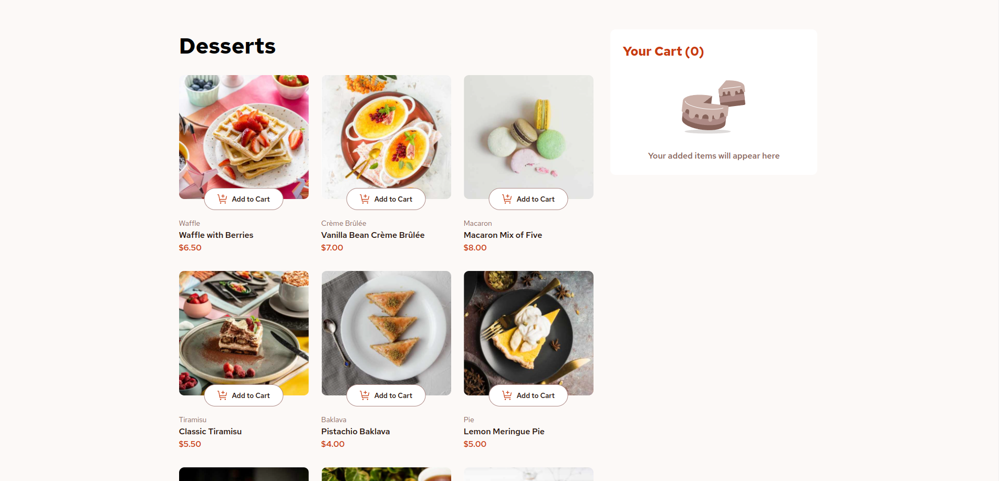
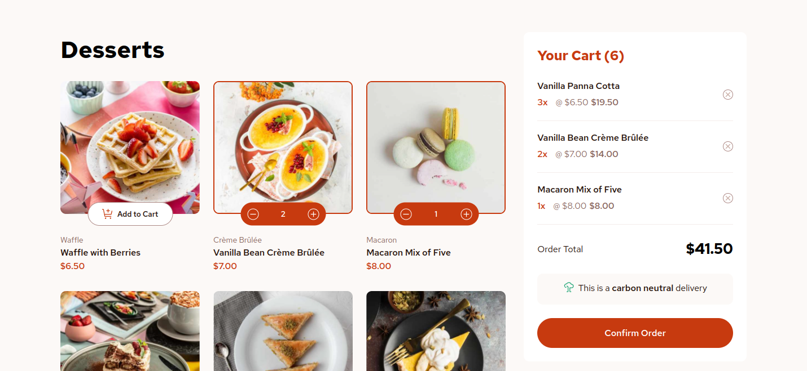
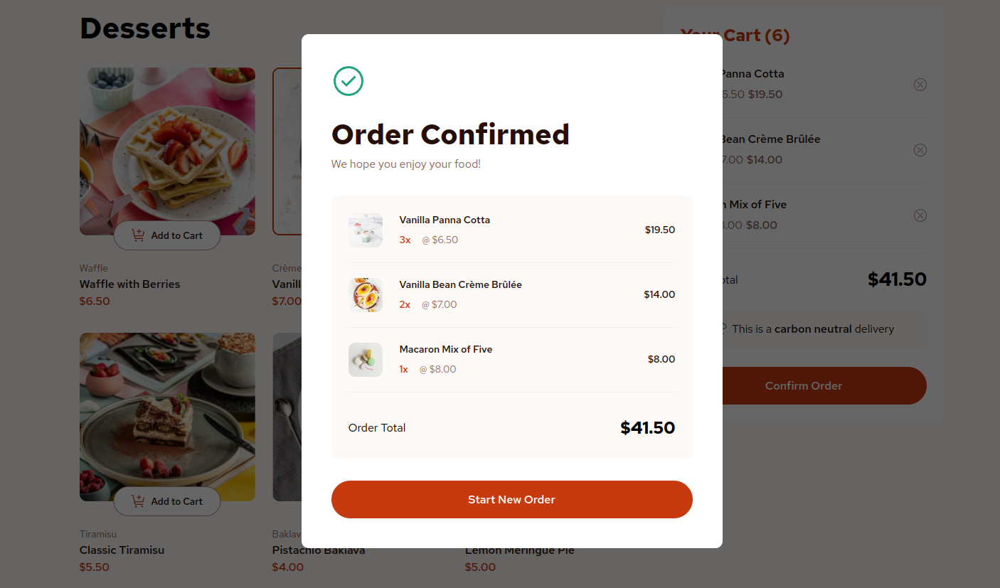
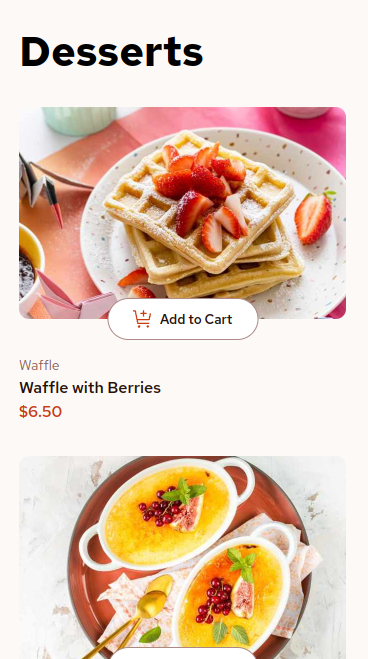
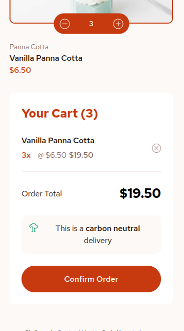
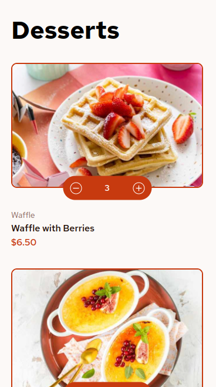
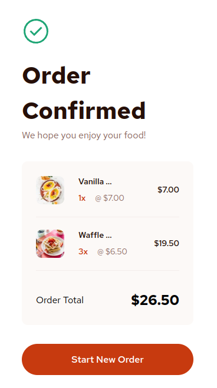

Here’s a suggestion for the `README.md` based on your project description and the given template:

---

# Frontend Mentor - Product List with Cart Solution

This is a solution to the [Product list with cart challenge on Frontend Mentor](https://www.frontendmentor.io/challenges/product-list-with-cart-5MmqLVAp_d). This challenge helps improve coding skills by building realistic projects.

## Table of contents

- [Overview](#overview)
  - [The challenge](#the-challenge)
  - [Screenshot](#screenshot)
  - [Links](#links)
- [My process](#my-process)
  - [Built with](#built-with)
  - [What I learned](#what-i-learned)
  - [Useful resources](#useful-resources)
- [Author](#author)

## Overview

### The challenge

Users can:

- Add items to the cart and remove them
- Increase/decrease the number of items in the cart
- See an order confirmation modal when clicking "Confirm Order"
- Reset selections by clicking "Start New Order"
- View the interface optimized for different screen sizes
- See hover and focus states for all interactive elements

### Screenshot

### Links

- Solution URL: [Frontend Mentor Solution](https://www.frontendmentor.io/solutions/product-list-with-functional-cart-solution)
- Live Site URL: [Live Site](https://petrakoow.github.io/FrontendMentorProductList/)

## My process

### Built with

- Semantic HTML5 markup
- SCSS/Sass (7-1 pattern) for styling
- CSS Grid and Flexbox for layout
- Media queries for responsiveness
- JSON for data handling
- JavaScript (OLOO - Object Linking to Other Objects) for object-oriented approach
- Gulp for project automation (Sass compilation, vendor prefixes, and deploying to GitHub Pages)

### What I learned

This project allowed me to practice working with:

- **JavaScript object-oriented programming (OLOO pattern)** for handling product cards and cart functionality.
- **SCSS 7-1 pattern** for better organizing stylesheets, ensuring maintainability and scalability.
- **Gulp** for setting up workflows that automated development tasks like compiling SCSS to CSS, live reloading, and deploying to GitHub Pages.
- **Working with JSON** files to dynamically populate product information on the UI.
  
This was my first project on Frontend Mentor using JavaScript, and it helped me learn how to integrate front-end tools effectively.

### Useful resources

- [MDN Web Docs](https://developer.mozilla.org/) - Great resource for learning more about JavaScript and web development in general.

## Author

- GitHub - [petrakoow](https://github.com/petrakoow)
- Frontend Mentor - [@petrakoow](https://www.frontendmentor.io/profile/Petrakoow)
